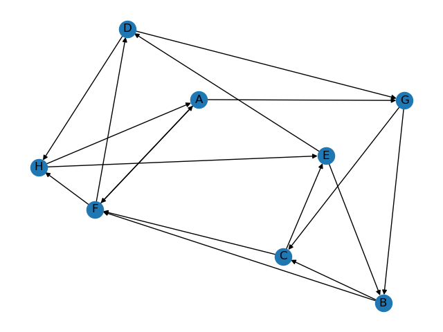
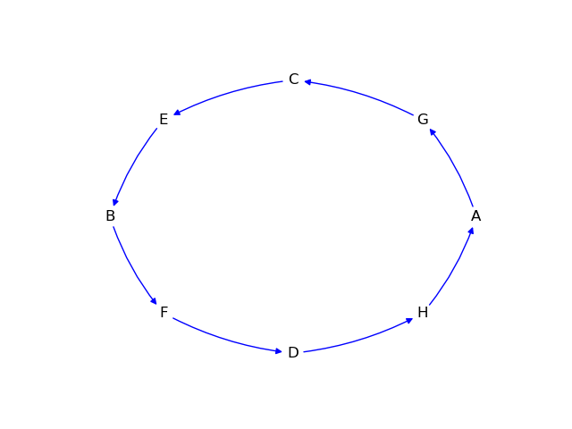

# Hamiltonian Gift Exchange
This program creates a Hamiltonian cycle for a gift exchange with many people.  Can include pairs of people who don't want to give gifts to each other in the exchange, such as partners, or people who gave gifts to each other last year.  This is nice for large families during holidays where a gift exchange makes more sense than everybody buying for everybody.  A [Hamiltonian cycle](https://en.wikipedia.org/wiki/Hamiltonian_path) is a cycle that visits each vertex exactly once.  This is valuable in this usecase because it means the gift exchange can be done in one big cycle, where Person A gives to Person B, then Person B gives to Person C, until finally the last person gives to Person A.  It also prevents small cycles, such as Person A giving to Person B and Person B giving to Person A.

## Installation
Download and run via Python.  You may need to install [networkx](https://networkx.org/documentation/stable/install.html).

## Usage
Open names.csv and write your list of names.  Make sure to not include any unnecessary whitespace.
```
A,B,C,D,E,F,G,H
```
Now open badpairs.csv to include pairs who do not go together.  The top rows underneath the text badpairs are universal: no matter what these people will not give gifts to each other.
```
badpairs
A,B
C,D
E,F
G,H
```
Still in badpairs.csv, you can also add previous years' exchanges.  This will allow you to include previous years into badpairs, in other words, people don't have to buy for the same person again for several years.
```
year2020
A,C
B,G
C,H
D,B
E,A
G,E
H,D
...
year2023
A,D
D,E
E,C
C,B
B,H
H,F
F,G
G,A
```
Make a list of the previous years you want to include in badpairs.  If you go back too many years, or if you have too many badpairs, a Hamiltonian cycle may not exist.  So you may need to alter this until a Hamiltonian cycle exists.
```
prevYears = [year2023,year2022,year2021,year2020]
```
Run the program.
```
python hamiltonian-gift-exchange.py
```
You will get a popup of the digraph that represents all possible gift exchanges (i.e. the complete digraph minus the badpairs).  This is the digraph that the program will attempt to find a Hamiltonian cycle in, and isnt very useful for the end result. You can save this or exit the window.



Then you will get a second popup of the Hamiltonian cycle that is the gift exchange.  You will also get some text output in the terminal.



```
Hamiltonian Cycle: ['A', 'G', 'C', 'E', 'B', 'F', 'D', 'H', 'A']
```

## Roadmap
- Make a separate names file.
- Make a separate badpairs file.
- Make program more interactive, maybe an initialization routine if names and badpairs are blank. 
- Ask user to include latest cycle in the badpairs file, prompt for name.
- Automate the prevYears portion: make it include as many years as possible while a Hamiltonian cycle exists.
- Package in a docker container.
- Package in a smartphone app.
